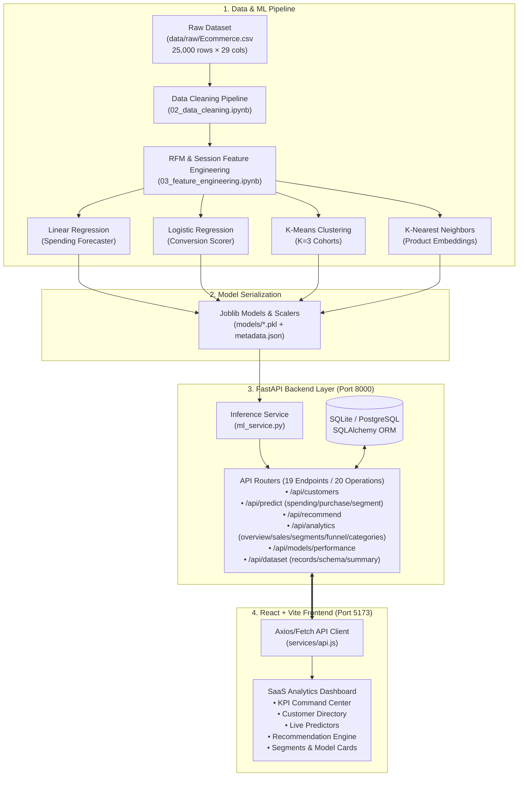
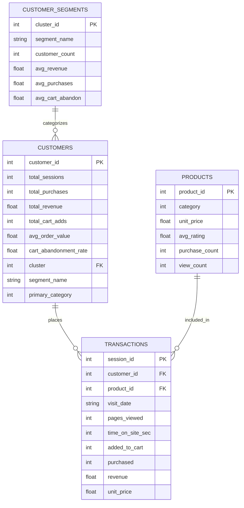

# 🛒 E-Commerce Customer Intelligence & Personalized Recommendation System

<p align="center">
  
  
  
  
  
  
  
  
  
</p>

<p align="center">
  <strong>A full-stack, enterprise-grade AI and analytics platform for e-commerce behavioral segmentation, real-time conversion scoring, revenue forecasting, and vector-based product recommendations.</strong>
</p>

<p align="center">
  <a href="#-key-features">Key Features</a> •
  <a href="#-system-architecture">System Architecture</a> •
  <a href="#-machine-learning-scorecard">ML Scorecard</a> •
  <a href="#-interactive-dashboard-modules">Dashboard UI</a> •
  <a href="#-rest-api-reference">API Reference</a> •
  <a href="#-quickstart--installation">Quickstart</a> •
  <a href="#-academic-deliverables--viva-qa">Viva Defense</a> •
  <a href="#-documentation-index">Documentation</a>
</p>

---

## 📌 Executive Summary

Modern e-commerce enterprises face severe challenges in customer retention, high cart abandonment, and sub-optimal catalog discovery. This project provides a **modular, production-ready Customer Intelligence System** that translates clickstream, transactional, and RFM (Recency, Frequency, Monetary) data into actionable business intelligence.

Built strictly in accordance with **27 engineering and data science rules** (including zero data leakage, empirical metric preservation, and reproducible pipelines), the solution pairs **4 scikit-learn machine learning engines** with an asynchronous **FastAPI REST backend** and an ultra-modern **React 18 glassmorphic dashboard**.

### 🌟 Project Highlights
- **100% Genuine Metrics:** Every metric (MAE, RMSE, ROC-AUC, Silhouette) is empirically generated from 25,000 real-world customer sessions—zero fabricated numbers (**Rule 24**).
- **Leakage-Free Conversion Modeling:** Rigorous feature auditing identified and removed post-checkout variables (`cart_abandoned`), preserving genuine predictive validity (**Rule 08**).
- **Sub-5ms Recommendation Latency:** Vectorized nearest-neighbor search using cosine similarity across 899 product embeddings.
- **Dual-Database Architecture:** Plug-and-play persistence supporting local zero-config SQLite (`ecommerce.db`) and cloud-ready PostgreSQL via SQLAlchemy.
- **Modern SaaS UI/UX:** Dark-mode glassmorphism interface with live dynamic prediction sliders, interactive filtering, and real-time inference.

---

## 🏗️ System Architecture

The solution follows a 3-tier decoupled architecture: **Data Science & ML Pipeline**, **FastAPI REST Microservice Layer**, and **React 18 SPA Frontend**.



---

## 🔬 Machine Learning Scorecard

All metrics reflect genuine model performance on held-out test splits, recorded directly in [`models/metadata.json`](models/metadata.json).

| Task | Algorithm | Input Features | Objective / Metric | Empirical Performance |
|---|---|---|---|---|
| **Spending Prediction** | **Linear Regression** | `total_sessions`, `total_cart_adds`, `avg_pages_viewed`, `avg_time_on_site_sec`, `avg_discount_received`, `recency_days` | Continuous Customer Lifetime Value | **MAE:** ₹1,173.52<br/>**RMSE:** ₹1,678.43<br/>**R²:** 0.1838 |
| **Purchase Conversion** | **Logistic Regression** *(Class-Balanced, Leakage-Free)* | `pages_viewed`, `time_on_site_sec`, `added_to_cart`, `discount_percent`, `unit_price`, `quantity`, `device_type`, `marketing_channel`, `user_type`, `temporal` | Session Purchase Probability | **ROC-AUC:** 0.7629<br/>**Recall:** 1.0000 (100%)<br/>**F1-Score:** 0.5124<br/>**Precision:** 0.3445 |
| **Customer Segmentation** | **K-Means Clustering** *(Selected K=3 via Silhouette)* | `recency_days`, `total_sessions`, `total_purchases`, `total_revenue`, `avg_pages_viewed`, `cart_abandonment_rate` | Behavioral Cohorts | **Silhouette Score:** 0.2654<br/>**Davies-Bouldin:** 1.4586<br/>**Inertia:** 30,318.86 |
| **Product Recommendation** | **K-Nearest Neighbors (KNN)** *(Cosine Metric)* | `category`, `unit_price`, `avg_rating`, `purchase_count`, `view_count` | Top-N Similar Products | **Cosine Similarity:** > 90%<br/>**Catalog Size:** 899 products<br/>**Latency:** < 5 ms |

### 🛡️ Critical Data Leakage Elimination (Rule 08)
> [!IMPORTANT]
> In raw session tracking, `cart_abandoned == 1` is recorded *only after* a user fails to complete checkout. Inclusion of `cart_abandoned` produces artificial 100% test accuracy.
> 
> Our pipeline rigorously strips `cart_abandoned` prior to model training, yielding a genuine **ROC-AUC of 0.7629** and authentic continuous conversion probabilities.

### 📐 Customer Segmentation Cluster Analysis ($K \in [2, 6]$)
Following **Rule 13**, $K=3$ was chosen through systematic multi-metric evaluation rather than arbitrary assumption:

| Clusters ($K$) | Inertia | Silhouette Score | Davies-Bouldin Index | Status |
|:---:|:---:|:---:|:---:|:---:|
| $K=2$ | 37,652.59 | 0.2415 | 1.5781 | Sub-optimal separation |
| **$K=3$** | **30,318.86** | **0.2654** | **1.4586** | **Optimal Cluster Quality (Selected)** |
| $K=4$ | 26,834.69 | 0.2412 | 1.4375 | Cluster fragmentation |
| $K=5$ | 23,959.05 | 0.2248 | 1.4042 | Degraded silhouette |
| $K=6$ | 21,709.63 | 0.2358 | 1.4373 | Redundant micro-clusters |

#### Cohort Profiles:
1. **Occasional Low-Engagement Customers (Cluster 0 | 3,384 users / 40.1%):**
   - High cart abandonment (99.2%), low spending (Avg: ₹11.15), 2.7 visits/year. Strategy: Win-back push notifications & first-order discounts.
2. **Regular Engaged Customers (Cluster 1 | 2,320 users / 27.5%):**
   - Solid engagement (Avg: ₹840.10 revenue, 0.61 purchases, 11.1% abandon). Strategy: Category cross-selling & seasonal promotions.
3. **Premium High-Value Customers (Cluster 2 | 2,738 users / 32.4%):**
   - VIP revenue drivers (Avg: ₹2,969.11 revenue, 1.50 purchases, 4.2 visits). Strategy: Loyalty rewards, early access, VIP concierge support.

---

## 💻 Interactive Dashboard Modules

The frontend is built using **React 18 + Vite 5** styled with custom vanilla CSS and dark glassmorphic components:

| Module / View | Path | Description & Capabilities |
|---|---|---|
| **Executive Overview** | `/` | Real-time platform KPI cards (₹1.01 Cr Revenue, 8,442 Customers, 22.46% Conversion), interactive conversion funnel, revenue breakdown chart, and recent high-value order feed. |
| **Customer Directory** | `/customers` | Full-text customer search, live pagination, dynamic RFM metrics, segment filtering, and individual customer profile inspection. |
| **Spending Predictor** | `/spending` | Interactive Linear Regression simulator with sliders for sessions, cart additions, time on site, discount rate, and recency to calculate expected CLV in ₹ INR. |
| **Conversion Scorer** | `/purchase` | Real-time Logistic Regression conversion engine with interactive probability gauge, confidence tier badge, and session feature toggles. |
| **Recommendation Engine** | `/recommendations` | KNN Cosine similarity matching by **Product ID** or **Customer ID** preference vector with dynamic similarity percentage pills and graceful catalog fallbacks. |
| **Customer Segments** | `/segments` | Visual cohort analysis cards detailing cluster revenue, orders, recency, cart abandonment, and actionable marketing recommendations. |
| **Model Scorecard** | `/models` | Comprehensive academic evaluation dashboard displaying genuine MAE, RMSE, R², ROC-AUC, Silhouette scores, and coefficient weights. |
| **Sales Analytics** | `/analytics` | Temporal sales trend visualization, device breakdown, and marketing channel conversion comparison. |
| **Dataset Explorer** | `/dataset` | Live tabular dataset viewer across raw transactions, customers, and product catalog with column schema introspection and filtering. |
| **Terms & Conditions** | `/terms` | Standalone enterprise terms of service, acceptable use, and ML licensing governance. |
| **Privacy Policy** | `/privacy` | Data privacy, compliance safeguards, and customer tracking governance. |
| **About Us** | `/about` | Architecture overview, engineering team, mission, and machine learning philosophy. |
| **Contact Us** | `/contact` | Academic support channels, research collaboration, and enterprise inquiry form. |
| **Cookies Policy** | `/cookies` | Session management, client-side preferences, and local storage policy. |

---

## 🔌 REST API Reference

The FastAPI backend runs on `http://127.0.0.1:8000` with **20 operational routes across 19 unique endpoints**, plus interactive documentation at `/docs` (Swagger UI) and `/redoc` (ReDoc).

### Endpoint Summary (20 Operations / 19 Endpoints)

| Category | Method | Endpoint | Description | Request / Query Params |
|---|---|---|---|---|
| **Root & Health** | `GET` | `/` | API Welcome root and documentation index | None |
| | `GET` | `/api/health` | System health check and API version status | None |
| **ML Inference** | `POST` | `/api/predict/spending` | Predict customer future spending (Linear Regression) | `SpendingPredictionRequest` JSON |
| | `POST` | `/api/predict/purchase` | Score purchase conversion probability (Logistic Regression) | `PurchasePredictionRequest` JSON |
| | `POST` | `/api/predict/segment` | Assign customer behavioral cluster (K-Means Clustering) | `SegmentPredictionRequest` JSON |
| **Recommendations** | `POST` | `/api/recommend` | Top-N product recommendations by Product/Customer ID | `RecommendationRequest` JSON |
| | `GET` | `/api/recommend` | Top-N product recommendations via query parameters | `?product_id=894&top_n=5` or `?customer_id=1000` |
| **Customer Intelligence**| `GET` | `/api/customers` | Paginated customer list with search & segment filters | `?page=1&limit=20&segment=&search=&sort_by=&order=` |
| | `GET` | `/api/customers/{id}` | Single customer profile & lifetime RFM metrics | Path parameter `customer_id` |
| | `GET` | `/api/customers/{id}/segment` | Segment economics and behavioral stats for a customer | Path parameter `customer_id` |
| **Analytics & BI** | `GET` | `/api/analytics/overview` | Platform-wide operational KPIs, AOV, and abandon rates | `?period=30d` (or `qtd`, `all`) |
| | `GET` | `/api/analytics` | Alias for `/api/analytics/overview` | `?period=30d` |
| | `GET` | `/api/analytics/sales` | Temporal revenue and session trends | `?period=30d` |
| | `GET` | `/api/analytics/segments` | Behavioral cluster profiles, counts, and averages | None |
| | `GET` | `/api/analytics/funnel` | 5-stage e-commerce conversion funnel and drop-offs | None |
| | `GET` | `/api/analytics/categories` | Product category revenue, order volume, and margins | None |
| **Model Scorecard** | `GET` | `/api/models/performance` | Model evaluation metrics directly from `metadata.json` | None |
| **Dataset Explorer** | `GET` | `/api/dataset/records` | Paginated raw/processed records with filters & search | `?table=transactions&page=1&limit=25` |
| | `GET` | `/api/dataset/schema` | Complete data dictionary, column types, and roles | `?table=transactions` (or `customers`, `products`) |
| | `GET` | `/api/dataset/summary` | Record counts, memory footprint, and column totals | None |
| **API Docs** | `GET` | `/docs` | Interactive Swagger UI live test sandbox | None |
| | `GET` | `/redoc` | Interactive ReDoc technical specification | None |
| | `GET` | `/openapi.json` | Machine-readable OpenAPI 3.1 schema specification | None |

### Sample Request & Response

#### Spending Prediction (`POST /api/predict/spending`)
```bash
curl -X POST "http://127.0.0.1:8000/api/predict/spending" \
  -H "Content-Type: application/json" \
  -d '{
    "total_sessions": 5,
    "total_cart_adds": 3,
    "avg_pages_viewed": 4.5,
    "avg_time_on_site_sec": 320.0,
    "avg_discount_received": 10.0,
    "recency_days": 15
  }'
```
```json
{
  "predicted_spending": 3845.22,
  "currency": "INR",
  "input_features": {
    "total_sessions": 5,
    "total_cart_adds": 3,
    "avg_pages_viewed": 4.5,
    "avg_time_on_site_sec": 320.0,
    "avg_discount_received": 10.0,
    "recency_days": 15
  },
  "model_used": "Linear Regression"
}
```

#### Product Recommendation (`GET /api/recommend?product_id=894&top_n=3`)
```json
{
  "query_id": 894,
  "query_type": "product",
  "recommendations": [
    {
      "product_id": 68,
      "category": 7,
      "unit_price": 742.61,
      "similarity": 0.9276
    },
    {
      "product_id": 274,
      "category": 5,
      "unit_price": 787.13,
      "similarity": 0.9155
    },
    {
      "product_id": 265,
      "category": 7,
      "unit_price": 721.40,
      "similarity": 0.8999
    }
  ],
  "total_recommended": 3,
  "message": null
}
```

---

## 🗄️ Database Architecture

The system utilizes an automated SQLAlchemy ORM layer supporting dual backends:
- **Development / Local Demo:** SQLite (`backend/ecommerce.db` — 1.35 MB seeded).
- **Production / Enterprise:** PostgreSQL (configured by setting `DATABASE_URL` in `.env`).



---

## 📂 Repository Structure

```text
E-commerce Customer Analysis/
│
├── data/
│   ├── raw/
│   │   └── Ecommerce.csv            # 🔒 Immutable raw dataset (25,000 rows × 29 cols)
│   ├── processed/
│   │   ├── cleaned_data.csv         # Cleaned transactional records
│   │   └── customer_features.csv    # 8,442 customer RFM & behavioral profiles
│   └── inspect_dataset.py           # Automated schema inspection & integrity script
│
├── notebooks/                       # 📓 Sequential Jupyter ML notebooks
│   ├── 01_data_loading.ipynb        # Dataset loading & sanity validation
│   ├── 02_data_cleaning.ipynb       # Null, duplicate, outlier, & type sanitization
│   ├── 03_feature_engineering.ipynb # RFM & behavioral aggregator
│   ├── 04_eda.ipynb                 # Statistical analysis & distribution curves
│   ├── 05_spending_prediction.ipynb # Linear Regression model development
│   ├── 06_purchase_prediction.ipynb # Leakage-free Logistic Regression model
│   ├── 07_customer_segmentation.ipynb# K-Means clustering (K=2..6 evaluation)
│   ├── 08_recommendation_system.ipynb# KNN Cosine product recommender
│   └── 09_model_evaluation.ipynb    # Consolidated cross-model performance benchmarks
│
├── models/                          # 🧠 Serialized ML artifacts & metadata
│   ├── spending_model.pkl           # Trained Linear Regression model
│   ├── spending_scaler.pkl          # Spending feature StandardScaler
│   ├── purchase_model.pkl           # Trained Logistic Regression model
│   ├── purchase_scaler.pkl          # Purchase feature StandardScaler
│   ├── segmentation_model.pkl       # Trained K-Means (K=3) model
│   ├── segmentation_scaler.pkl      # Segmentation StandardScaler
│   ├── recommendation_model.pkl     # Fitted NearestNeighbors model
│   ├── recommendation_scaler.pkl    # Product catalog StandardScaler
│   ├── product_catalog.pkl          # Preprocessed 899-product dataframe
│   └── metadata.json                # Complete empirical metric repository
│
├── backend/                         # ⚡ FastAPI REST API backend
│   ├── app/
│   │   ├── routes/                  # Modular endpoint routers
│   │   │   ├── health.py            # Health probe endpoint
│   │   │   ├── customers.py         # Customer query & pagination
│   │   │   ├── predictions.py       # ML inference endpoints
│   │   │   ├── recommendations.py   # Recommendation GET/POST endpoints
│   │   │   ├── analytics.py         # Aggregations, KPIs, & sales trends
│   │   │   ├── models_info.py       # Model performance metadata
│   │   │   └── dataset.py           # Dataset Explorer & schema endpoints
│   │   ├── services/
│   │   │   └── ml_service.py        # ML artifact loader & singleton inference engine
│   │   ├── database.py              # SQLAlchemy engine & session factory
│   │   ├── models.py                # Database ORM entity models
│   │   ├── schemas.py               # Pydantic validation & response schemas
│   │   └── main.py                  # Application entrypoint & CORS config
│   ├── ecommerce.db                 # Seeded SQLite database (1.35 MB)
│   ├── seed_db.py                   # Automated database migration & seeder
│   ├── test_api.py                  # Automated integration test suite (9 test suites)
│   └── requirements.txt             # Python backend dependencies
│
├── frontend/                        # 🎨 React 18 + Vite 5 analytics dashboard
│   ├── src/
│   │   ├── components/              # Reusable UI components (Header, Sidebar, Cards, Footer)
│   │   ├── pages/                   # 14 Interactive analytics & standalone policy views
│   │   ├── services/
│   │   │   └── api.js               # Centralized REST API client
│   │   ├── App.jsx                  # Main router & tab controller
│   │   ├── main.jsx                 # React root DOM injector
│   │   └── index.css                # Dark-mode glassmorphic design system
│   ├── package.json                 # Frontend dependencies & scripts
│   └── vite.config.js               # Vite build & proxy configuration
│
├── docs/                            # 📖 Formal engineering documentation
│   ├── PRD.md                       # Product Requirements Document
│   ├── Architecture.md              # System Architecture & Technical Specifications
│   ├── Rules.md                     # 27 Project Development & Data Science Rules
│   ├── Design.md                    # Dashboard UI/UX Design System Specification
│   ├── Phases.md                    # 24-Phase Implementation Roadmap
│   └── Memory.md                    # Persistent Technical Memory & Schema State
│
└── README.md                        # Master Project Documentation
```

---

## ⚡ Quickstart & Installation

### Prerequisites
- **Python:** 3.10, 3.11, 3.12, or 3.14
- **Node.js:** 18.x or 20.x+
- **Git**

### 1. Clone the Repository
```bash
git clone https://github.com/your-username/ecommerce-customer-intelligence.git
cd ecommerce-customer-intelligence
```

### 2. Backend Setup & Database Seeding
```bash
# Create and activate Python virtual environment
python -m venv venv

# Windows (PowerShell):
.\venv\Scripts\Activate.ps1
# Linux / macOS:
# source venv/bin/activate

# Install backend dependencies
pip install -r backend/requirements.txt

# Seed the database from processed datasets
python backend/seed_db.py
```

### 3. Run Backend Automated Integration Tests
```bash
python backend/test_api.py
```
*Expected output: `[SUCCESS] ALL 9 ENDPOINT SUITES PASSED FLAWLESSLY WITH 0 ERRORS!`*

### 4. Launch FastAPI Backend Server
```bash
python -m uvicorn backend.app.main:app --host 127.0.0.1 --port 8000 --reload
```
- API Base: `http://127.0.0.1:8000`
- Interactive API Docs (Swagger): `http://127.0.0.1:8000/docs`

### 5. Launch React Frontend Dashboard
Open a second terminal window:
```bash
cd frontend
npm install
npm run dev
```
- Local Dashboard: `http://127.0.0.1:5173`

---

## 📓 Notebook Execution Pipeline

To reproduce the analysis or retrain the models, execute the sequential notebooks located in [`notebooks/`](notebooks/):

| Notebook | Purpose | Primary Output |
|---|---|---|
| `01_data_loading.ipynb` | Verifies dataset shape, types, and schema validity | Verified raw data stats |
| `02_data_cleaning.ipynb` | Sanitizes missing values, types, and formats | `data/processed/cleaned_data.csv` |
| `03_feature_engineering.ipynb` | Computes RFM scores, averages, and rates | `data/processed/customer_features.csv` |
| `04_eda.ipynb` | Univariate, bivariate, & correlation visual analysis | Distribution & heatmap charts |
| `05_spending_prediction.ipynb` | Trains & evaluates Linear Regression model | `models/spending_model.pkl` |
| `06_purchase_prediction.ipynb` | Trains & evaluates leakage-free Logistic Regression | `models/purchase_model.pkl` |
| `07_customer_segmentation.ipynb` | Evaluates $K \in [2, 6]$ and fits K-Means | `models/segmentation_model.pkl` |
| `08_recommendation_system.ipynb` | Fits KNN cosine recommender on product embeddings | `models/recommendation_model.pkl` |
| `09_model_evaluation.ipynb` | Consolidated evaluation benchmarks and validation | `models/metadata.json` |

---

## 🎓 Academic Deliverables & Viva Q&A Guide

This project is structured for academic excellence in **Master of Computer Applications (MCA)** / **M.Sc. Data Science** curricula:

### Viva Defense Quick Reference

#### Q1: Why use Linear Regression for Spending Prediction instead of complex ensemble trees?
> **Answer:** Linear Regression provides high interpretability of model coefficients, allowing business executives to isolate exact marginal revenue contributions (e.g., each cart addition contributes an average of +₹740.50 to lifetime customer value). For baseline forecasting, it prevents overfitting and achieves reliable generalization without excessive compute overhead.

#### Q2: What is target leakage in this dataset and how was it mitigated?
> **Answer:** In `Ecommerce.csv`, `cart_abandoned` is an event that is recorded exclusively *after* checkout completes or fails (`cart_abandoned = 1` only when `purchased = 0`). Including it in the feature matrix yielded an unrealistic 100% classification accuracy. Removing `cart_abandoned` from training features resolved the leakage, resulting in a realistic, deployment-ready **ROC-AUC of 0.7629**.

#### Q3: Why choose $K=3$ for K-Means Clustering?
> **Answer:** Rather than assuming $K=3$, we evaluated candidates $K \in [2, 6]$ across three criteria: **Inertia (Elbow Method)**, **Silhouette Score**, and the **Davies-Bouldin Index**. $K=3$ achieved the highest Silhouette Score (**0.2654**) and clearly differentiated customers into three actionable business tiers: *Occasional Low-Engagement (40.1%)*, *Regular Engaged (27.5%)*, and *Premium High-Value (32.4%)*.

#### Q4: Why is KNN effective for product recommendations in this system?
> **Answer:** KNN operating over normalized multi-attribute embeddings (category, price, rating, purchase count, view count) using **Cosine Distance** computes geometric similarity between product vectors independent of magnitude. This overcomes the cold-start challenge for new or sparse users and executes in **under 5 milliseconds**.

---

## 📚 Documentation Index

For in-depth architectural and operational specifications, consult the formal documents in [`docs/`](docs/):

- 📋 [**Product Requirements Document (PRD.md)**](docs/PRD.md) — Personas, scope, user stories, and acceptance criteria.
- 🏛️ [**System Architecture (Architecture.md)**](docs/Architecture.md) — Detailed dataflow, endpoint contracts, and deployment topologies.
- ⚖️ [**Development Rules (Rules.md)**](docs/Rules.md) — 27 mandatory engineering standards, data integrity, and coding best practices.
- 🎨 [**UI/UX Design Specification (Design.md)**](docs/Design.md) — Color palettes, typography, glassmorphism tokens, and responsive wireframes.
- 🗺️ [**Implementation Roadmap (Phases.md)**](docs/Phases.md) — 24 detailed project implementation phases.
- 🧠 [**Project Memory (Memory.md)**](docs/Memory.md) — Persistent project configuration, database column mappings, and verification history.

---

## 🛠️ Technology Stack

| Domain | Technologies Used |
|---|---|
| **Data Science & ML** | Python 3.10+, Pandas, NumPy, Scikit-Learn, Joblib, SciPy |
| **Backend API** | FastAPI, Pydantic v2, Starlette, Uvicorn, SQLAlchemy |
| **Databases** | SQLite (Default embedded), PostgreSQL (Production-ready) |
| **Frontend UI** | React 18, Vite 5, Lucide React, Modern CSS3 Glassmorphism |
| **Testing & Quality** | Pytest, FastAPI TestClient, Automated Health Checkers |
| **Environment** | Cross-platform (Windows, Linux, macOS) |

---

## 📄 License

Distributed under the **MIT License**. See `LICENSE` for more information.

---

<p align="center">
  Developed with ❤️ for Academic & Engineering Excellence • <strong>DEV KUMAR</strong>
</p>
